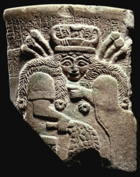

# Nisaba

Named after Nisaba — the Sumerian scribe of gods (𒀭𒉀).

## About

Collection of finite-state transducer-based (FST) tools for visual
normalization, well-formedness, transliteration and NFC normalization of various
scripts from South Asia and beyond. Currently supported script families:

*  Brahmic scripts ([documentation](nisaba/brahmic/README.md)).

## Building and testing

This library will build on any system that supports
[Bazel](https://bazel.build/) build and test tool.

## Contributions

NOTE We don't accept pull requests (PRs) at the moment.

## License

Nisaba is licensed under the terms of the Apache license. See [LICENSE](LICENSE)
for more information.

## Mandatory disclaimer

This is not an official Google product.
