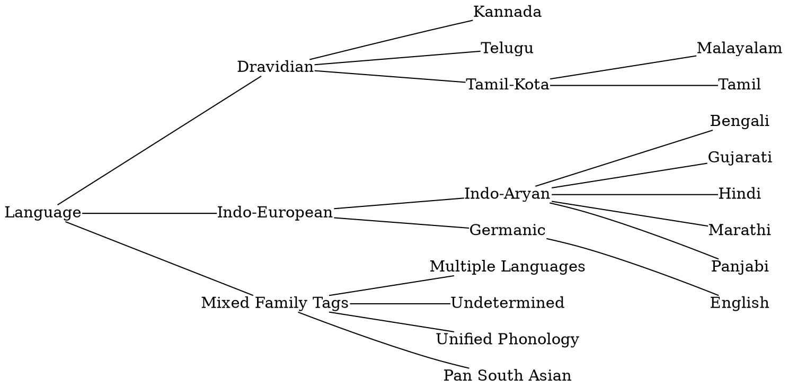

# Languages

Feature family tree for the supported
[languages](https://github.com/google-research/nisaba/blob/main/nisaba/scripts/natural_translit/phonology/features/README.md#language).

<!-- AUTO-GENERATED INVENTORY STRING STARTS HERE -->

